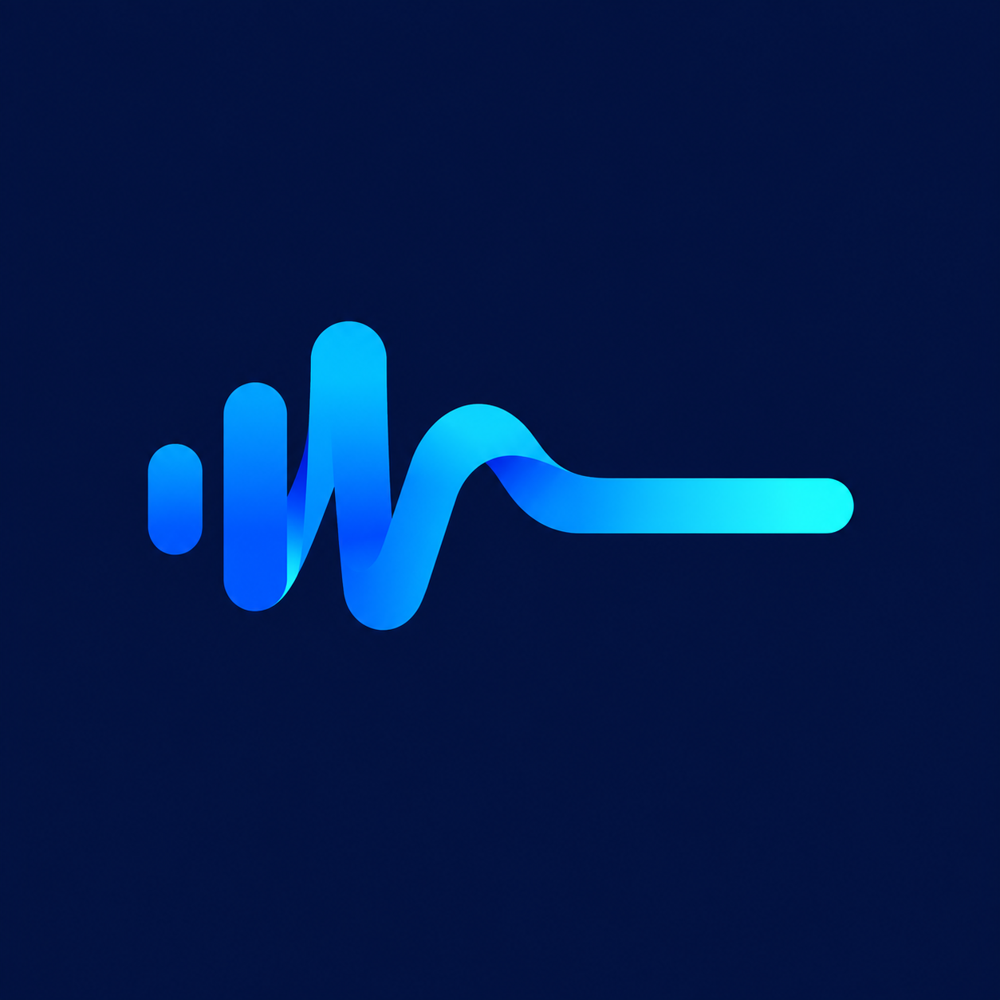
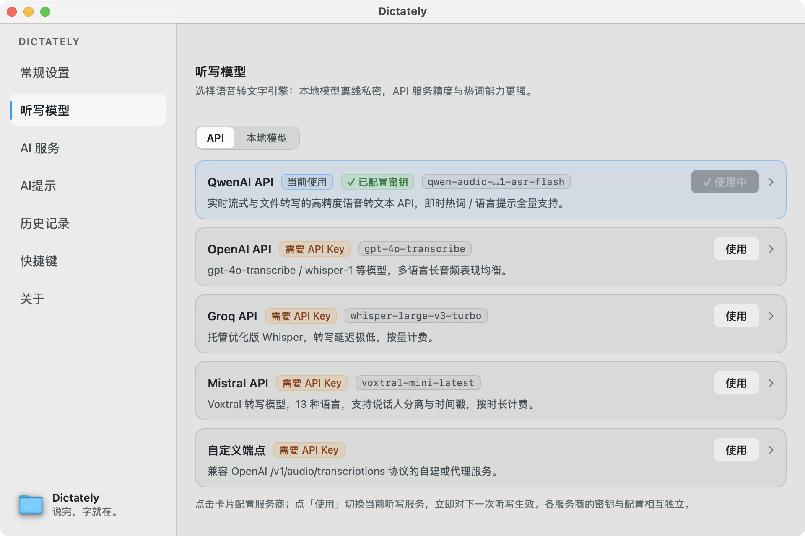
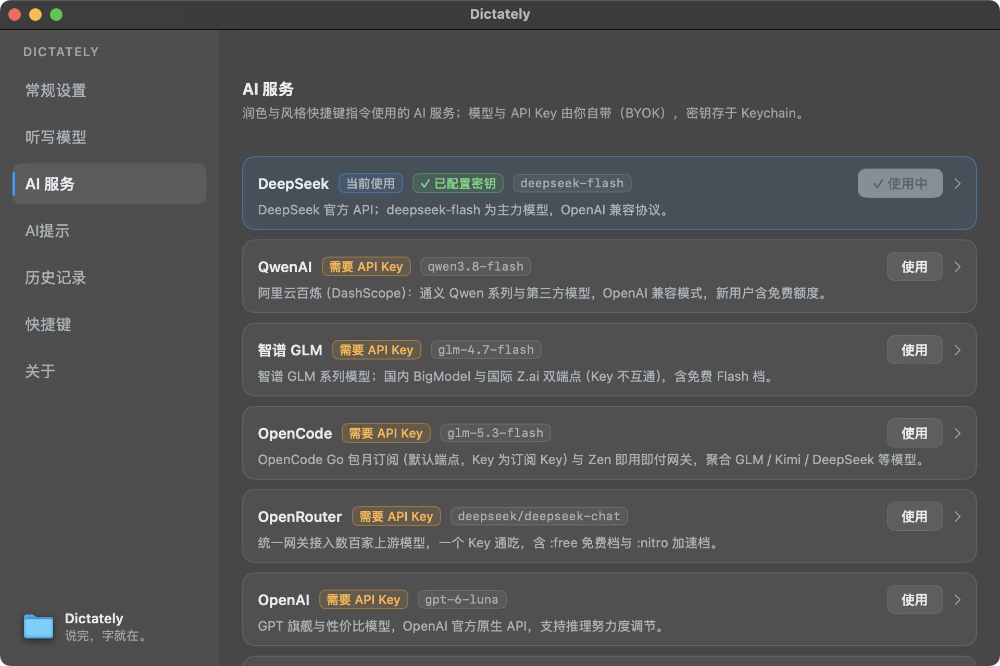

<div align="center">



# Dictately

**Speak. It's there.**

English · [简体中文](README.md)


A native macOS dictation tool: press the hotkey in any app, speak, and your words are transcribed in the cloud, optionally AI-polished, and pasted at your cursor within 1–3 seconds.

</div>

---

## Highlights

**Dictation**

- Start with a **double-tap of right ⌘** by default — the frontmost app keeps focus; trigger mode is switchable (double-tap / hold / toggle) and every hotkey is recordable and customizable
- The recording HUD floats at the bottom of the **screen your cursor is on**, with a live timer; `Esc` cancels anytime
- Accidental-tap guard: recordings shorter than 300 ms are silently discarded instead of sending empty requests
- Recording cap adjustable from 90–300 seconds (default 240), auto-finishes on timeout

**AI styles**

- Three built-in styles to turn a raw transcript into finished text:
  - `⌘1` **Intent recognition** — restructures spoken transcription into clean, concise written text
  - `⌘2` **Casual polish** — keeps your natural spoken voice, trimming only filler and noise
  - `⌘3` **Chinese–English translation** — tidies the transcript, then translates between the two languages while preserving meaning
- Create your own styles: custom prompt templates (with a `{text}` placeholder), description, on/off toggle, and a dedicated hotkey each

**History & reliability**

- Transcripts, polished results, and audio are all stored locally (SQLite), with filtering, search, and multi-select batch delete
- Failure-friendly: network errors auto-retry once; dictation entries can be re-transcribed, and styled entries regenerated (re-run the polish on the original text)
- Recordings left unfinished by a crash are offered for **orphan recovery** on next launch

**Multi-provider BYOK (bring your own key)**

- 5 transcription providers and 7 AI-service providers (see below); keys are stored per provider in the **macOS Keychain**
- Reasoning effort is **off by default and actually enforced** — an explicit per-provider "off" parameter is sent rather than simply omitted
- Model parameters never send dirty values; leaving a field empty falls back to its default

**Details**

- Light / dark / auto appearance
- Optional: start/stop sound effects, system-wide mute while recording, auto-copy to clipboard, menu-bar icon, hiding the Dock icon, launch at login
- No accounts, no analytics, no telemetry

## Screenshots

| Dictation models (light) | AI services (dark) |
| :---: | :---: |
|  |  |

## Getting started

Download the latest DMG from [Releases](../../releases), open it, and drag Dictately into **Applications**.

**First launch (important):** Dictately uses an ad-hoc signature (no developer certificate) and is not notarized by Apple, so Gatekeeper will block the first launch. Use any of the following to allow it:

- **Right-click Dictately in Applications → Open → click “Open” again**;
- or System Settings → Privacy & Security → scroll down and click “Open Anyway”;
- or run in Terminal:

  ```bash
  xattr -d com.apple.quarantine /Applications/Dictately.app
  ```

A two-step onboarding walks you through granting microphone and accessibility access. The transcription API key is configured afterwards in the Dictation models settings page (which shows a hint chip and banner until one is set).

### Requirements

- macOS 14 (Sonoma) or later
- An Apple Silicon Mac (M1 or later; current builds are arm64-only)
- An API key for at least one transcription provider (some providers offer free tiers)

### Permissions

| Permission | Purpose |
| --- | --- |
| Microphone | Recording speech; audio is sent only to the transcription service you configure |
| Accessibility | Global hotkey listening; pasting text into the frontmost app (simulated ⌘V) |

## Transcription providers (ASR)

| Provider | Default model | Notes |
| --- | --- | --- |
| QwenAI API | `qwen-audio-3.1-asr-flash` | Supports instant hot words (≤50), language hints, dialect retention |
| OpenAI | `gpt-4o-transcribe` | OpenAI-compatible endpoint |
| Groq | `whisper-large-v3-turbo` | OpenAI-compatible endpoint |
| Mistral | `voxtral-mini-latest` | OpenAI-compatible endpoint |
| Custom endpoint | — | Any OpenAI-compatible `/audio/transcriptions` (http allowed for local services) |

## AI-service providers (LLM)

**DeepSeek** (default) · **Alibaba Bailian** · **Zhipu GLM** · **OpenCode** · **OpenRouter** · **OpenAI** · **Custom endpoint**

Each provider stores its own base URL / model / API key; pick a model from the preset dropdown or enter a custom model ID.

## Privacy & data

- **API keys live only in the macOS Keychain**, per provider, and are never uploaded anywhere
- History and audio stay local: `~/Library/Application Support/Dictately/` (one click to open via General settings → Data folder)
- Audio retention: 30 days (default) / 90 days / forever
- Apart from the ASR/LLM endpoints you configure, the app makes no outbound network calls

## Building from source

Requires macOS 14+ and the Xcode Command Line Tools (`xcode-select --install`). **Full Xcode is not needed** — the project builds directly with SwiftPM; the only third-party dependency is [GRDB.swift](https://github.com/groue/GRDB.swift).

```bash
git clone https://github.com/Aprilpl/Dictately.git
cd Dictately
./scripts/build.sh          # swift build → assembles build/Dictately.app → signs it
open build/Dictately.app    # run it
```

> Note: for maintenance reasons the public repository does not ship the unit-test bundle; `swift build` and `./scripts/build.sh` are unaffected.

## Known limitations

- Local offline transcription is not available yet (that settings section shows an explanatory card only — no fake toggles).
- Intel Macs are not supported or tested (current builds are arm64 / Apple Silicon only).
- The app is not notarized; after each version update you must clear Gatekeeper once more.

## License

[MIT](LICENSE) © 2026 Aprilpl
